# USB 3.1 Gen 1 to Gigabit Ethernet Adapter

LAN7800-based USB 3.1 Gen 1 to Gigabit Ethernet adapter designed in **Altium Designer** as a high-speed hardware and PCB design portfolio project.

<p align="center">
  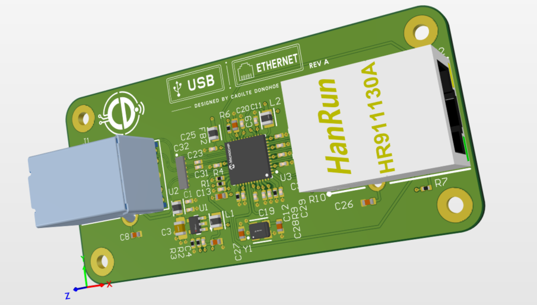
</p>

## Project Overview

The design converts a **USB 3.1 Gen 1 (5 Gbit/s)** host connection to **10/100/1000BASE-T Ethernet** using the Microchip **LAN7800** USB-to-Ethernet controller.

The project was developed to demonstrate complete hardware design intent rather than schematic capture alone: component selection, power architecture, controlled-impedance routing, high-speed PCB constraints, grounding and return-path control, manufacturability rules, DRC, and fabrication documentation.

### Key design features

- Microchip **LAN7800** USB 3.1 Gen 1 to Gigabit Ethernet controller
- USB 2.0 and USB 3.x interfaces
- Gigabit Ethernet MDI interface to RJ45 MagJack
- **4-layer PCB** with dedicated internal ground reference planes
- **90 Ω differential impedance** target for USB
- **100 Ω differential impedance** target for Gigabit Ethernet
- Dedicated Altium **net classes, differential-pair classes and routing rules**
- Length matching and controlled pair spacing for high-speed interfaces
- Separate power routing/pours for the LAN7800 supply rails
- ESD/protection components positioned close to the external interfaces
- Fabrication drawing and manufacturing output preparation
- Final PCB checked using Altium DRC

## High-Speed Design Approach

The PCB was treated as a **high-speed design**, with the layout driven by signal-integrity and return-path requirements rather than by simple point-to-point connectivity.

The main design methods used were:

- **Controlled impedance:** dedicated Altium impedance profiles were created for 90 Ω USB and 100 Ω Ethernet differential routing.
- **Differential-pair classes:** USB 2.0, USB 3.x and Ethernet MDI signals were separated into dedicated classes so interface-specific constraints could be applied consistently.
- **Length matching:** matched-length rules were used to control skew within high-speed differential pairs, with separate Ethernet pair-to-pair matching constraints.
- **Continuous reference planes:** the high-speed signals are routed primarily on the outer signal layer over an adjacent solid ground reference plane.
- **Layer restrictions:** high-speed classes were constrained to intended routing layers to avoid unnecessary layer changes and reference-plane discontinuities.
- **Controlled spacing and clearance:** dedicated rules were used for pair geometry, pair-to-pair spacing and clearance from unrelated copper.
- **Via control:** separate via styles were defined for general and higher-current power routing.
- **Power integrity:** local power pours, short decoupling paths and large ground regions were used around the LAN7800 and its regulators.
- **Manufacturing constraints:** minimum annular ring, drilled-hole, solder-mask and silkscreen rules were included in the PCB rule set.
- **Rule-driven verification:** Altium's PCB Rules and Constraints system and DRC were used to check that the physical implementation remained consistent with the design intent.

> **Design status:** this repository presents the Rev A schematic, PCB layout and fabrication design intent. It does not claim production or laboratory signal-integrity validation.

## PCB Layout

### Top side

The top layer carries the principal signal routing, including the USB and Ethernet differential interfaces and the LAN7800 support circuitry.

<p align="center">
  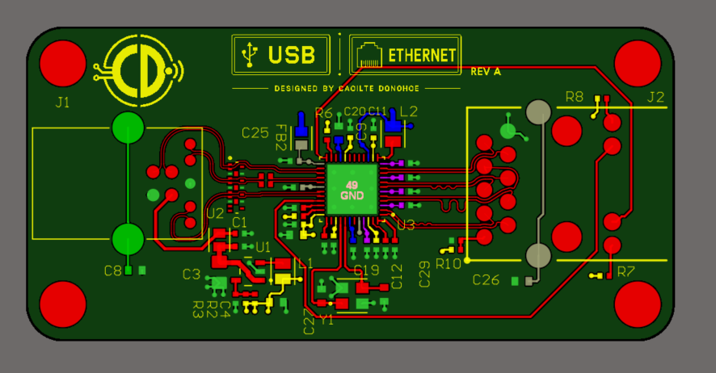
</p>

### Bottom side — power and ground distribution

The bottom side is used for local power distribution together with a broad GND copper pour. The internal ground planes provide the primary high-speed reference structure.

<p align="center">
  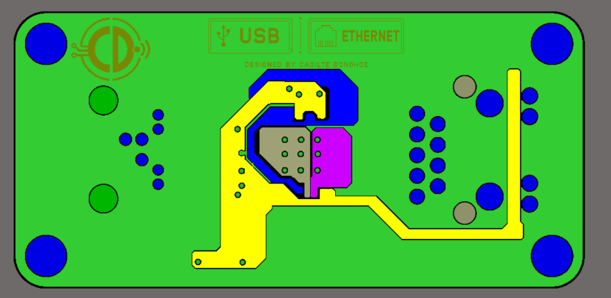
</p>

## Schematic

The design is split into two functional sheets: **USB/power** and **LAN7800/Ethernet**.

<p align="center">
  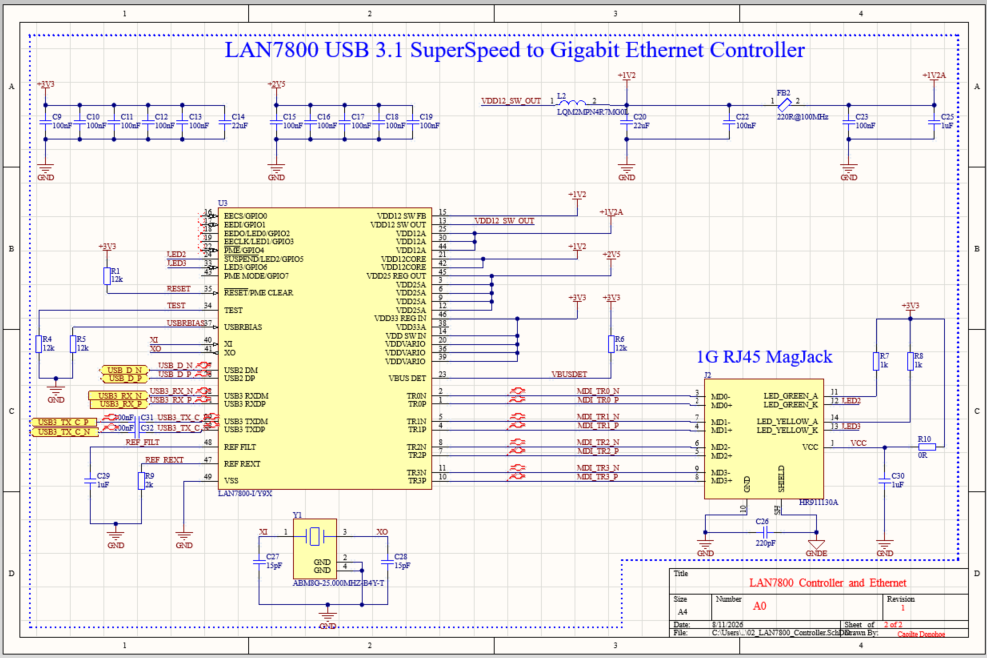
</p>

<details>
<summary><b>View USB and power schematic overview</b></summary>

<p align="center">
  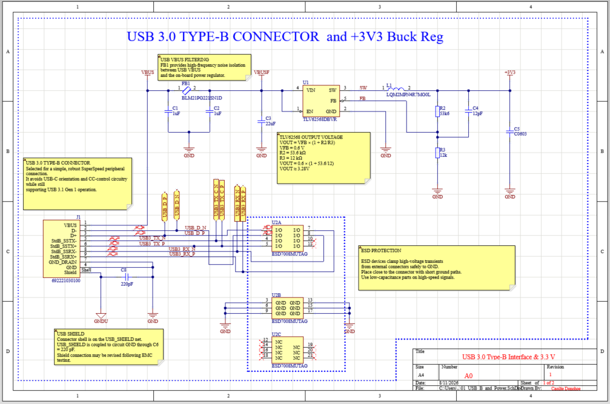
</p>

</details>

**[View the complete schematic PDF](Docs/LAN7800_USB_Ethernet_RevA_Schematic.pdf)**

**[View the Rev A fabrication drawing](Docs/LAN7800_USB_Ethernet_RevA_Fabrication.PDF)**

**[Download the Rev A fabrication package](Manufacturing/LAN7800_USB_Ethernet_RevA_Fabrication.zip)**  
Gerber X2, NC Drill and fabrication documentation.

## Design Verification

A final Altium **Design Rule Check** was run against the configured PCB rule set after layout and copper-pour completion. The final report shows **0 warnings and 0 rule violations**.

<p align="center">
  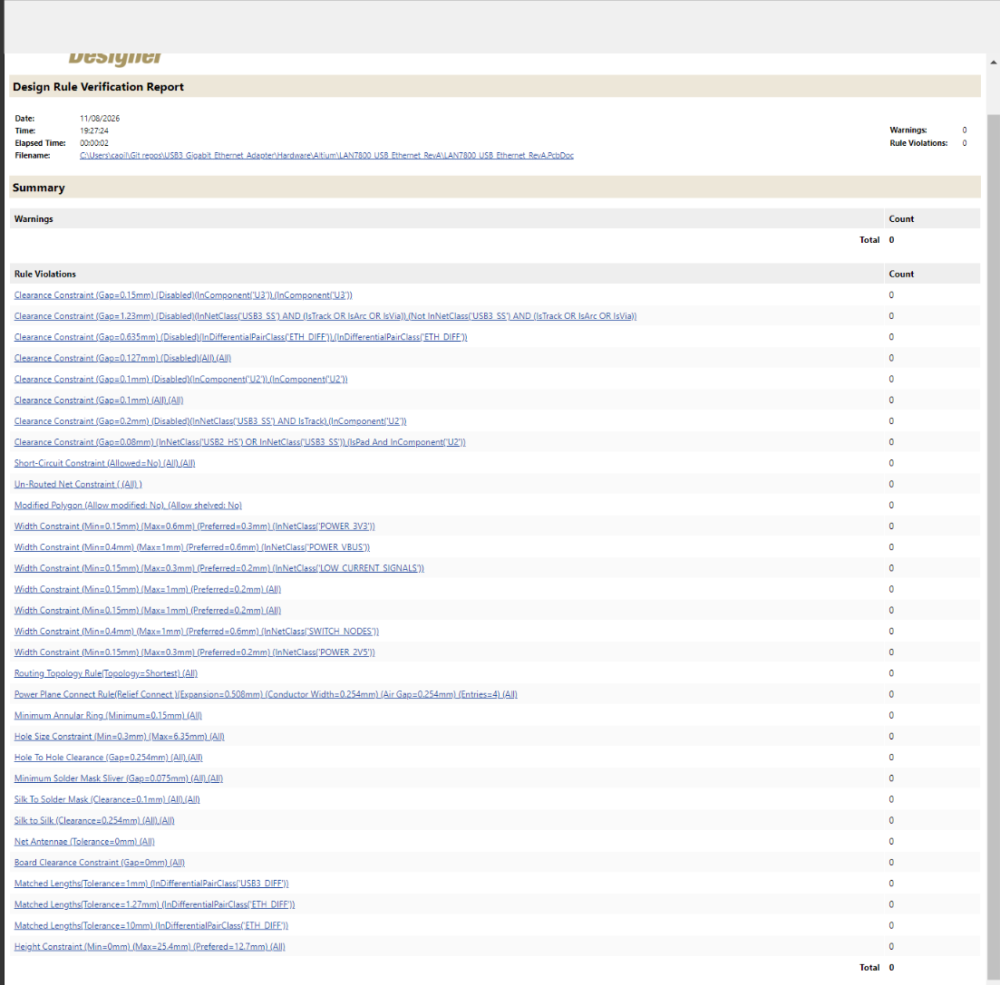
</p>

## Altium Design Rules

The design uses a rule-driven approach rather than manually routing each interface with ad-hoc settings. Representative rule configuration is shown below.

<details>
<summary><b>View high-speed stack-up, impedance and rule configuration</b></summary>

### Layer stack

<p align="center">
  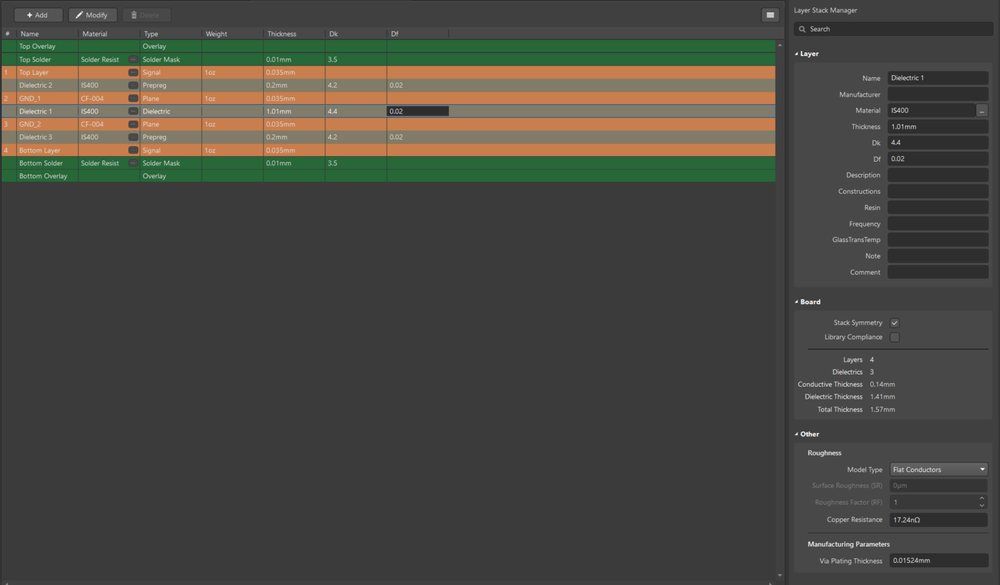
</p>

### Controlled-impedance profiles

<p align="center">
  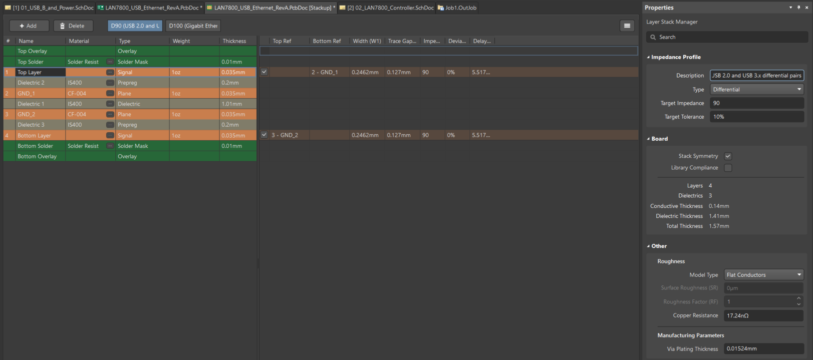
</p>

### Net classes

<p align="center">
  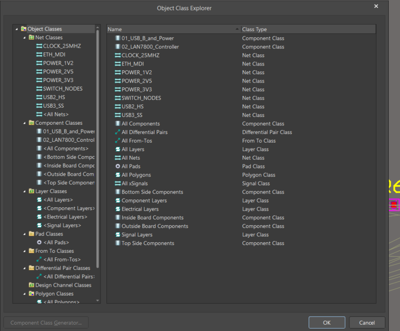
</p>

### Differential-pair routing rules

<p align="center">
  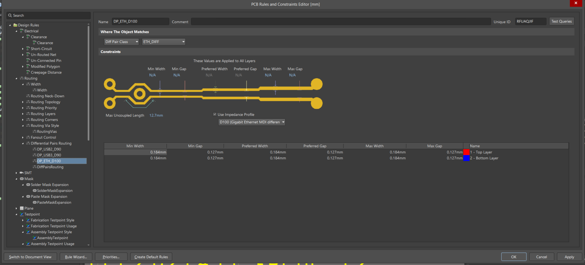
</p>

### Matched-length rules

<p align="center">
  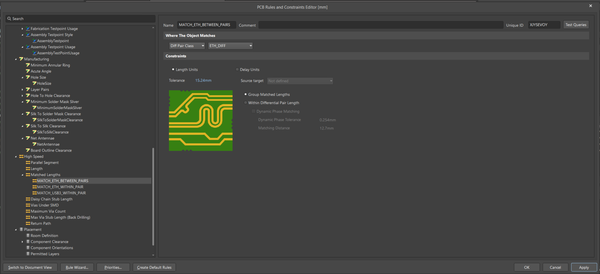
</p>

</details>

## Repository Contents

```text
Hardware/Altium/   Editable Altium schematic and PCB source
Docs/              Schematic and fabrication PDFs
Images/            PCB, schematic and selected design-rule images
Manufacturing/     Rev A Gerber X2 and NC Drill fabrication package
```

The public repository is intentionally kept concise so the design can be reviewed quickly, while the editable Altium sources remain available for deeper technical inspection.

---

**Designed by Caoilte Donohoe**
